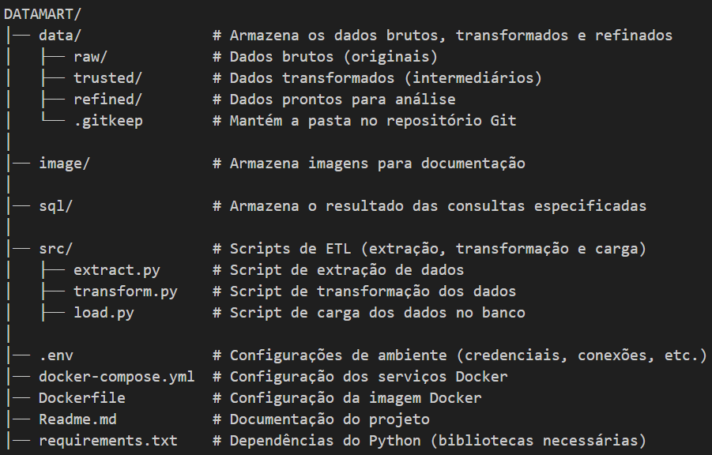

<div align='center'>


</div>

# Teste para vaga de Engenheiro de Dados no Magazord.com.br
Este repositório tem como fim testar os candidatos para vaga de engenheiro de dados na empresa [Magazord](https://magazord.com.br).
> Para esta vaga buscamos alguém apaixonado por Dados e como disponibilizar de maneira estrutura e eficiente para tomada de decisão sobre esses dados!


<details> <summary><strong>☰ SUMÁRIO</strong></summary>

## 1. Introdução  
- [Visão Geral](#visão-geral)  
- [Estrutura Final do Projeto](#estrutura-final-do-projeto)  
- [Tecnologias Utilizadas](#tecnologias-utilizadas)  
- [Dependências](#dependências)  

## 2. Configuração e Execução  
- [Como Executar o Projeto](#como-executar-o-projeto)  
 
## 3. Pipeline ETL  
- [Como Funciona o ETL](#como-funciona-o-etl)  
  - [1️⃣ Extração (`extract.py`)](#1-extração-extractpy)  
  - [2️⃣ Transformação (`transform.py`)](#2-transformação-transformpy)  
  - [3️⃣ Carga (`load.py`)](#3-carga-loadpy)  

## 4. Configuração do Docker  
- [Passo a Passo do Processo do Docker](#passo-a-passo-do-processo-do-docker)  
  - [1️⃣ Docker Compose (`docker-compose.yml`)](#1-docker-composeyml)  
  - [2️⃣ Dockerfile (`Dockerfile`)](#2-dockerfile)  

## 5. Passo a Passo dos Processos  
- [Processo de Extração](#passo-a-passo-do-processo-de-extração)  
- [Processo de Transformação](#passo-a-passo-do-processo-de-transformação)  
- [Processo de Carga](#passo-a-passo-do-processo-de-carga)  

## 6. Consultas Analíticas  
- [1️⃣ Receita Total por Categoria de Produto](#1-receita-total-por-categoria-de-produto)  
- [2️⃣ Top 5 Produtos Mais Vendidos em um Período de Tempo](#top-5-produtos-mais-vendidos-em-um-período-de-tempo)  
- [3️⃣ Número de Clientes Ativos nos Últimos 3 Meses](#número-de-clientes-ativos-que-fizeram-pelo-menos-1-compra-nos-últimos-3-meses)  

## 7. Otimização do Pipeline  
- [1️⃣ Indexação nas Tabelas](#11-indexação-nas-tabelas-do-banco-de-dados)  
- [2️⃣ Particionamento de Dados](#12-estratégias-de-particionamento)  
- [3️⃣ Paralelização no Processo de Transformação](#13-paralelização-no-processo-de-transformação)  

## 8. Decisões Técnicas  
- [1️⃣ Uso do PostgreSQL](#decisões-técnicas)  
- [2️⃣ Armazenamento em Parquet](#decisões-técnicas)  
- [3️⃣ Uso do Docker & Docker Compose](#decisões-técnicas)  
- [4️⃣ Execução Sequencial dos Scripts ETL](#decisões-técnicas)  

</details>

## Visão Geral

Este projeto é um pipeline ETL (Extract, Transform, Load) que processa dados de clientes, produtos e transações, aplica transformações e carrega os dados em um banco de dados PostgreSQL. O objetivo é estruturar e disponibilizar os dados para tomada de decisão. O pipeline é executado em um ambiente Docker, garantindo reprodutibilidade e facilidade de uso.

## Estrutura Final do Projeto




## Tecnologias Utilizadas

- Python 3.9: Linguagem principal para o pipeline ETL.
- Pandas: Manipulação de dados.
- SQLAlchemy: Conexão com o banco de dados PostgreSQL.
- PostgreSQL 13: Banco de dados para armazenamento final.
- Docker: Containerização do ambiente.
- Docker Compose: Orquestração dos serviços (PostgreSQL e ETL).

## Dependências

As dependências do projeto estão listadas no arquivo requirements.txt:

- pandas
- requests
- sqlalchemy
- psycopg2-binary
- python-dotenv
- pyarrow

## Como Executar o Projeto

**Pré-requisitos**

- Docker: Instalado na máquina.
- Docker Compose: Geralmente vem com o Docker, mas certifique-se de que está instalado.

Passo a Passo:

**1. Clone ou faça o download do Repositório**

- `git clone https://github.com/seu-usuario/seu-projeto.git`
- [datamart](https://github.com/seu-usuario/seu-projeto.git)
- `cd seu-projeto`

**2. Instale o Docker (Se Necessário)**
Se você ainda não tem o Docker instalado, siga as instruções abaixo:

* Linux:
```
sudo apt update
sudo apt install docker.io docker-compose
sudo systemctl start docker
sudo systemctl enable docker
```

* Windows/Mac:

Baixe e instale o Docker Desktop a partir do site oficial: <a href="https://www.docker.com/get-started/" target="_blank">Docker</a>


**3. Definir Usuário, Senha, Porta e Nome do Banco de dados**

* Abrir o arquivo `.env`
  - `DB_URL=postgresql://seunome:suasenha@db:5432/nomedobancodedados`
  - Estou passando como padrão, minhas informações:`DB_URL=postgresql://lucas:1234@db:5432/datamart`
  - Usuário: Lucas
  - Senha: 1234
  - Porta: 5432
  - Nome do Banco de dados: datamart


**4. Construa e Inicie os Contêineres**

- No diretório raiz do projeto, execute:

`docker-compose up --build`


**Isso irá:**

- Construir a imagem do contêiner do pipeline ETL.
- Iniciar o contêiner do PostgreSQL.
- Executar o pipeline ETL (extração, transformação e carregamento).


**5. Verifique os Dados no PostgreSQL**

Após a execução do pipeline, os dados estarão disponíveis no banco de dados PostgreSQL. Você pode acessar o banco de dados usando o terminal ou uma ferramenta como pgAdmin ou psql.

Host: localhost

Porta: 5432

Banco de dados: meubanco

Usuário: usuario

Senha: senha

**Acesso Manual ao Banco de Dados no Terminal**

`docker start postgres_db`
`docker exec -it postgres_db psql -U usuario -d meubanco`

**6. Parar os Contêineres**

Para parar os contêineres, execute:

`docker-compose down`


## Como Funciona o ETL

### **1. Extração (extract.py)**

O script extract.py tem como objetivo baixar um arquivo ZIP do GitHub, extrair seus conteúdos e organizar os arquivos de dados em uma estrutura específica dentro do diretório data/raw/.

- Baixa um arquivo ZIP do repositório no GitHub.
- Extrai os arquivos contidos no ZIP.
- Move arquivos CSV soltos para data/raw.
- Encontra e extrai arquivos ZIP internos.
- Remove arquivos temporários.

### **2. Transformação (transform.py)**

Responsabilidade: Aplica transformações nos dados brutos.

- Carrega os arquivos CSV extraídos para DataFrames do Pandas.
- Verifica valores nulos e os preenche adequadamente.
- Remove duplicatas.
- Ajusta e padroniza os dados:
  - Concatena nome e sobrenome dos clientes.
  - Renomeia colunas dos produtos.
  - Concatena transações de múltiplos arquivos.
- Salva os dados transformados no formato Parquet na pasta data/trusted.

### **3. Carga (load.py)**

Responsabilidade: Carrega os dados transformados no banco de dados PostgreSQL.

- Cria o schema meu_schema no PostgreSQL.
- Cria as tabelas clientes, produtos e transacoes.
- Carrega os dados transformados nas tabelas do PostgreSQL.


## Passo a Passo do Processo do Docker

Este projeto utiliza Docker para containerização, garantindo um ambiente isolado e reprodutível e Docker Compose para orquestração dos serviços.

### 1. Docker-compose.yml

- O docker-compose.yml gerencia a orquestração dos serviços, incluindo um banco de dados PostgreSQL e o pipeline ETL.
- O docker-compose.yml define dois serviços principais:
  - db: Um contêiner PostgreSQL 13 para armazenar os dados.
  - etl-pipeline: Um contêiner que executa o pipeline ETL.

#### 1.1 Definição dos Serviços

```dockerfile
services:
  db:
    image: postgres:13
    container_name: postgres_db
    environment:
      POSTGRES_USER: usuario
      POSTGRES_PASSWORD: senha
      POSTGRES_DB: meubanco
    ports:
      - "5432:5432"
    volumes:
      - postgres_data:/var/lib/postgresql/data

  etl-pipeline:
    build: .
    volumes:
      - ./data:/app/data
    environment:
      DB_URL: postgresql://usuario:senha@db:5432/meubanco
    command: bash -c "python src/extract.py && python src/transform.py && python src/load.py"
    depends_on:
      - db

volumes:
  postgres_data:
```

#### 1.2 Explicação dos Parâmetros

- db: Define um contêiner com PostgreSQL 13.
- O banco de dados usa credenciais definidas via environment.
- Expõe a porta 5432.
- Os dados são persistidos no volume postgres_data.
- etl-pipeline: Contêiner responsável por executar o pipeline ETL.
- Mapeia a pasta data/ para /app/data dentro do contêiner.
- Define a URL de conexão ao banco de dados via DB_URL.
- O command executa os scripts ETL (extract.py, transform.py e load.py).
- depends_on garante que o banco de dados seja iniciado antes do ETL.

### 2. Dockerfile

O Dockerfile é responsável por construir a imagem do pipeline ETL.

#### 2.1 Definição do Dockerfile

```dockerfile
FROM python:3.9
WORKDIR /app
COPY . .
RUN pip install --no-cache-dir -r requirements.txt
CMD ["bash", "-c", "python src/extract.py && python src/transform.py && python src/load.py"]
```
#### 2.2 Explicação dos Parâmetros

- `FROM python:3.9`: Usa uma imagem base com Python 3.9.
- `WORKDIR /app`: Define /app como diretório de trabalho.
- `COPY . .`: Copia todos os arquivos do projeto para o contêiner.
- `RUN pip install --no-cache-dir -r requirements.txt`: Instala as dependências.
- `CMD [...]`: Define a execução padrão dos scripts ETL.

### Conclusão

O docker-compose.yml e o Dockerfile garantem um ambiente configurado para execução automatizada do pipeline ETL. O PostgreSQL é iniciado e mantém os dados persistentes, enquanto o contêiner ETL processa os dados de forma sequencial.

## Passo a Passo do Processo de Extração

O script extract.py tem como objetivo baixar um arquivo ZIP do GitHub, extrair seus conteúdos e organizar os arquivos de dados em uma estrutura específica dentro do diretório `data/raw/`.

### Bibliotecas Utilizadas

- O script utiliza as seguintes bibliotecas:
- `requests`: Para fazer o download do arquivo ZIP.
- `zipfile`: Para manipular arquivos ZIP.
- `os`: Para manipulação de diretórios e arquivos.
- `shutil`: Para mover e deletar arquivos e pastas.

### 1. Baixar o ZIP do GitHub
O script baixa um arquivo ZIP diretamente do repositório do GitHub e o salva localmente como `master.zip`.
```python
url = "https://github.com/magazord-plataforma/data_engineer_test/archive/refs/heads/master.zip"
zip_path = "master.zip"

with open(zip_path, "wb") as f:
    f.write(requests.get(url).content)
```

### 2. Extrair o ZIP principal
O ZIP baixado é extraído na pasta atual.
```python
with zipfile.ZipFile(zip_path, "r") as z:
    z.extractall(".")
```

### 3. Definir Caminhos
São definidos os caminhos das pastas relevantes para a organização dos arquivos extraídos:
```python
folder = "data_engineer_test-master"  # Pasta extraída
data_raw = "data/raw"  # Caminho para a pasta raw
os.makedirs(data_raw, exist_ok=True)  # Cria a pasta se não existir
```

### 4. Mover os arquivos CSV soltos
Os arquivos `cliente.csv` e `produtos.csv` são movidos para `data/raw/`, caso existam.
```python
for file in ["cliente.csv", "produtos.csv"]:
    file_path = os.path.join(folder, file)
    if os.path.exists(file_path):
        shutil.move(file_path, os.path.join(data_raw, file))
        print(f"✅ {file} movido para {data_raw}")
```

### 5. Encontrar e extrair os ZIPs internos
Os arquivos ZIP internos (`transacoes_1.zip`, `transacoes_2.zip`, etc.) são extraídos diretamente para `data/raw/`.
```python
for file in os.listdir(folder):
    if file.endswith(".zip"):
        with zipfile.ZipFile(os.path.join(folder, file), "r") as z:
            z.extractall(data_raw)
```

### 6. Limpeza
Após a extração e organização dos arquivos, o script remove o ZIP original e a pasta extraída para manter o diretório limpo.
```python
os.remove(zip_path)
shutil.rmtree(folder)
```

### 7. Mensagem Final
Ao concluir todas as operações, o script imprime uma mensagem de sucesso:
```python
print("🎉 Todos os arquivos foram movidos para 'data/raw/'")
```

### Conclusão
O script automatiza o processo de download, extração e organização dos arquivos de dados, garantindo que todos os arquivos CSV estejam centralizados na pasta `data/raw/`. Esse procedimento facilita a próxima etapa do pipeline ETL.


## Passo a Passo do Processo de Transformação

O script transform.py tem como objetivo realizar a transformação dos dados brutos armazenados na pasta data/raw e gerar arquivos no formato Parquet na pasta `data/trusted`.


### Bibliotecas Utilizadas

O script utiliza as seguintes bibliotecas:

- `os`: Para manipulação de diretórios.
- `pandas`: Para manipulação e transformação dos dados.
- `logging`: Para registrar mensagens sobre o andamento do processo.

### 1. Configuração Inicial

Define os diretórios e cria a pasta data/trusted caso ela não exista:

```python
raw_path  = "data/raw"
trusted_path = "data/trusted"
os.makedirs(trusted_path, exist_ok=True)
```

### 2. Carregar os Arquivos CSV

Os arquivos CSV localizados em data/raw são carregados como DataFrames do pandas:

```python
arquivos = [f for f in os.listdir(raw_path) if f.endswith('.csv')]
dfs = {arquivo: pd.read_csv(os.path.join(raw_path, arquivo)) for arquivo in arquivos}
```

### 3. Verificação de Valores Nulos

O script verifica se existem valores nulos e registra um aviso no logging caso existam:

```python
def verificar_nulos(dfs):
    for arquivo, df in dfs.items():
        nulos_existentes = df.isnull().sum()[df.isnull().sum() > 0]
        if not nulos_existentes.empty:
            logging.warning(f"⚠️ {arquivo} contém valores nulos:\n{nulos_existentes}")
        else:
            logging.info(f"✅ {arquivo}: sem valores nulos.")
verificar_nulos(dfs)
```

### 4. Tratamento de Valores Nulos

Os valores nulos são preenchidos com:

- Desconhecido para colunas de texto.
- 0 para colunas numéricas.
- 1970-01-01 para colunas de data.

### 5. Remoção de Duplicatas

O script remove registros duplicados de cada DataFrame:

```python
for arquivo in dfs:
    dfs[arquivo] = dfs[arquivo].drop_duplicates()
```

### 6. Transformando os Dados

* Cliente
  - Une os campos nome e sobrenome em um único campo nome_cliente.
  - Remove as colunas nome e sobrenome.
  - Renomeia colunas para um padrão mais coerente.

```python
dfs['cliente.csv'] = (
    dfs['cliente.csv']
    .assign(nome_cliente=lambda df: (df['nome'] + ' ' + df['sobrenome']).str.title())
    .drop(columns=['nome', 'sobrenome'])
    .rename(columns={'id': 'id_cliente', 'telefone': 'telefone', 'email': 'email'})
)
```

* Produtos
  - Remove a coluna EAN.
  - Renomeia colunas para padronização.

```python
dfs['produtos.csv'] = (
    dfs['produtos.csv']
    .drop(columns=['EAN'])
    .rename(columns={'id': 'id_produto', 'Nome': 'nome_produto', 'Descrição': 'categoria', 'Preço': 'preco'})
)
```

* Transações
  - Concatena os arquivos de transações (transacoes_1.csv, transacoes_2.csv, transacoes_3.csv).
  - Converte a coluna data_transacao para o formato de data.
  - Remove duplicatas.

```python
transacoes = (
    pd.concat([dfs['transacoes_1.csv'], dfs['transacoes_2.csv'], dfs['transacoes_3.csv']], ignore_index=True)
    .assign(data_transacao=lambda df: pd.to_datetime(df['data_transacao']).dt.date)
    .drop_duplicates()
)
```

### 7. Salvar os Dados Transformados em Parquet

Os arquivos transformados são salvos na pasta `data/trusted` em formato Parquet.

```python
arquivos_para_salvar = {
    'cliente.parquet': dfs['cliente.csv'],
    'produtos.parquet': dfs['produtos.csv'],
    'transacoes.parquet': transacoes
}
for nome_arquivo, df in arquivos_para_salvar.items():
    parquet_file = os.path.join(trusted_path, nome_arquivo)
    df.to_parquet(parquet_file, index=False, compression='snappy', engine='pyarrow')
    print(f"Arquivo salvo: {parquet_file}")
```

### 8. Visualização dos Dados

Por fim, o script imprime as 5 primeiras linhas de cada arquivo transformado.

```python
for nome_arquivo, df in arquivos_para_salvar.items():
    print(f"\n🔹 {nome_arquivo} (Top 5 linhas, {df.shape[0]} linhas no total):")
    print(df.head())
```
### Conclusão

O script transform.py realiza um pipeline de limpeza e transformação dos dados, garantindo a integridade e qualidade antes de serem utilizados para análise ou carga em um banco de dados. Ele estrutura os dados de forma padronizada e os armazena em formato Parquet, que é mais eficiente para processamento de grandes volumes de informação.


## Passo a Passo do Processo de Carga

O script load.py tem como objetivo carregar os dados transformados armazenados na pasta data/trusted para um banco de dados PostgreSQL, garantindo a estrutura correta das tabelas e a integridade dos dados.

### Bibliotecas Utilizadas

O script utiliza as seguintes bibliotecas:

- `os`: Para manipulação de diretórios.
- `dotenv`: Para carregar variáveis de ambiente do arquivo .env.
- `pandas`: Para manipulação dos dados.
- `sqlalchemy`: Para conexão e inserção de dados no banco PostgreSQL.

### 1. Configurações Iniciais

#### 1.1 Carregar as Variáveis de Ambiente

O script carrega a URL do banco de dados a partir do arquivo `.env`:

```python
from dotenv import load_dotenv
import os

load_dotenv()
db_url = os.getenv('DB_URL')

if db_url is None:
    raise ValueError("A variável de ambiente 'DB_URL' não está definida no arquivo .env.")
```

#### 1.2 Criar a Conexão com o Banco de Dados

A conexão com PostgreSQL é estabelecida usando SQLAlchemy:

```python
from sqlalchemy import create_engine, text
engine = create_engine(db_url)
```

### 2. Verificação e Criação de Estrutura

O script verifica se o schema meu_schema já existe, criando-o se necessário.

```python
with engine.begin() as conn:
    conn.execute(text("CREATE SCHEMA IF NOT EXISTS meu_schema"))
    print("✅ Schema 'meu_schema' criado/verificado com sucesso!")
```

### 3. Carregamento dos Arquivos Parquet

#### 3.1 Definir Diretórios

- Os diretórios de entrada e saída são configurados:

```python
trusted_path = '/app/data/trusted'
refined_path = '/app/data/refined'
os.makedirs(refined_path, exist_ok=True)
```

- Se a pasta trusted não existir, o script lança um erro:

```python
if not os.path.exists(trusted_path):
    raise FileNotFoundError(f"❌ O diretório '{trusted_path}' não foi encontrado!")

```

#### 3.2 Listar Arquivos Disponíveis

O script lista os arquivos Parquet na pasta trusted:

```python
parquet_files = [f for f in os.listdir(trusted_path) if f.endswith('.parquet')]

if not parquet_files:
    print("⚠️ Nenhum arquivo Parquet encontrado na pasta 'trusted'. Nada para processar.")
else:
    print(f"📂 {len(parquet_files)} arquivos Parquet encontrados. Iniciando o processamento...")
```

#### 3.3 Definir Esquema das Tabelas

O esquema das tabelas é definido para garantir que os tipos de dados estejam corretos ao carregar no PostgreSQL.

```python
from sqlalchemy import Integer, String, Float, Date, DECIMAL

schemas = {
    "clientes": {
        "id_cliente": Integer,
        "nome_cliente": String(100),
        "email": String(100),
        "telefone": String(15)
    },
    "produtos": {
        "id_produto": Integer,
        "nome_produto": String(100),
        "categoria": String(120),
        "preco": DECIMAL(10, 2)
    },
    "transacoes": {
        "id_transacao": Integer,
        "id_cliente": Integer,
        "id_produto": Integer,
        "quantidade": Integer,
        "data_transacao": Date
    }
}
```

### 4. Processar e Inserir os Dados no Banco

O script percorre os arquivos Parquet e os insere no banco de dados, garantindo que os tipos de dados estejam corretos antes da inserção.:

```python
for parquet_file in parquet_files:
    file_path = os.path.join(trusted_path, parquet_file)
    table_name = os.path.splitext(parquet_file)[0]

    try:
        df = pd.read_parquet(file_path)

        if table_name in schemas:
            for col, dtype in schemas[table_name].items():
                if col in df.columns:
                    if dtype == Date:
                        df[col] = pd.to_datetime(df[col])
                    elif dtype == Integer:
                        df[col] = df[col].astype("int")
                    elif dtype == Float or dtype == DECIMAL:
                        df[col] = df[col].astype("float")
                    elif isinstance(dtype, String):
                        df[col] = df[col].astype(str)

        refined_file_path = os.path.join(refined_path, parquet_file)
        df.to_parquet(refined_file_path, index=False)
        print(f"✅ Arquivo refinado salvo: {refined_file_path}")

        df.to_sql(table_name, engine, schema="meu_schema", if_exists="replace", index=False, dtype=schemas.get(table_name, {}))
        print(f"✅ Dados do arquivo {parquet_file} carregados na tabela '{table_name}' com sucesso!")
    
    except Exception as e:
        print(f"❌ Erro ao processar o arquivo {parquet_file}: {e}")
```

### Conclusão

O script load.py automatiza a carga de dados transformados para o banco de dados PostgreSQL, garantindo:

- Verificação e criação do schema meu_schema.
- Processamento correto dos arquivos Parquet.
- Aplicação dos tipos corretos aos dados.
- Persistência dos dados no banco de forma eficiente.
- Com isso, os dados ficam prontos para serem utilizados em análises e dashboards de BI.


## Consultas Analíticas

### **1. Receita total por categoria de produto.**

```sql
SELECT
    p.categoria,
    SUM(t.quantidade * p.preco) AS receita_total
FROM meu_schema.transacoes t
JOIN meu_schema.produtos p ON t.id_produto = p.id_produto
GROUP BY p.categoria
ORDER BY receita_total DESC;
```
* 🔎 O que retorna?
  - 👉 Retorna a receita total gerada por cada categoria de produto.
  - 👉 Faz a soma (SUM) do total vendido (quantidade * preco) para cada categoria.
  - 👉 Ordena da maior para a menor receita (ORDER BY receita_total DESC).

[Receita total por categoria de produto](sql/Receita%20total%20por%20categoria%20de%20produto.csv)


#### Possíveis otimizações:

* Índices para acelerar os JOINs e filtros
  - Criar um índice para a chave de junção (id_produto) melhora a performance:

```sql
CREATE INDEX idx_transacoes_id_produto ON meu_schema.transacoes(id_produto);
CREATE INDEX idx_produtos_id_produto ON meu_schema.produtos(id_produto);
```

* Indexação na coluna categoria
  - Se o agrupamento por categoria for frequente, um índice pode ajudar:

```sql
CREATE INDEX idx_produtos_categoria ON meu_schema.produtos(categoria);
```

* Reduzir leituras desnecessárias
  - Em vez de calcular SUM(t.quantidade * p.preco), pode-se pré-calcular os valores unitários na tabela transacoes, evitando multiplicação repetida.


### **Top 5 produtos mais vendidos em um período de tempo.**

```sql
SELECT
    p.id_produto,
    p.nome_produto,
    SUM(t.quantidade) AS total_vendido
FROM meu_schema.transacoes t
JOIN meu_schema.produtos p ON t.id_produto = p.id_produto
WHERE t.data_transacao BETWEEN '2023-11-01' AND '2024-02-01'
GROUP BY p.id_produto, p.nome_produto
ORDER BY total_vendido DESC
LIMIT 5;
```

* 🔎 O que retorna?
  - 👉 Lista os 5 produtos mais vendidos entre 01/11/2023 e 01/02/2024.
  - 👉 Soma (SUM) a quantidade vendida (total_vendido).
  - 👉 Ordena do mais vendido para o menos (ORDER BY total_vendido DESC).
  - 👉 Limita para os Top 5 (LIMIT 5).

[Top 5 produtos mais vendidos em um período de tempo](sql/Top%205%20produtos%20mais%20vendidos%20em%20um%20período%20de%20tempo.csv)


#### Possíveis otimizações:

* Índices para acelerar os JOINs e filtros
  - Índice na coluna de data (data_transacao), já que estamos filtrando um intervalo de tempo:

```sql
CREATE INDEX idx_transacoes_data ON meu_schema.transacoes(data_transacao);
```

* Índice na chave de junção (id_produto)

```sql
CREATE INDEX idx_transacoes_id_produto ON meu_schema.transacoes(id_produto);
```

* Particionamento da tabela
  - Se transacoes tiver milhões de registros, pode-se particionar a tabela por mês ou ano:

```sql
CREATE TABLE meu_schema.transacoes_2023_11 PARTITION OF meu_schema.transacoes
FOR VALUES FROM ('2023-11-01') TO ('2023-11-30');
```

- Isso acelera buscas em períodos específicos.

* Usar LIMIT corretamente
  - O ORDER BY total_vendido DESC LIMIT 5 pode ser otimizado com um índice sobre quantidade para acelerar a ordenação.


### **Número de clientes ativos (que fizeram pelo menos 1 compra) nos últimos 3 meses.**

1. Query 1 (Usa CURRENT_DATE): 

```sql
SELECT 
    COUNT(DISTINCT t.id_cliente) AS clientes_ativos
FROM meu_schema.transacoes t
WHERE t.data_transacao >= CURRENT_DATE - INTERVAL '3 months';
```

* CURRENT_DATE retorna apenas a data atual, sem considerar o horário (exemplo: 2025-02-27 00:00:00).
* Isso significa que a query sempre compara com o início do dia.
* Se você rodar essa consulta às 23:59, ainda estará pegando todos os dados desde o início do dia 3 meses atrás.

✅ Mais confiável se você quer considerar dias inteiros (ou seja, todos os registros de um determinado dia).

[Número de clientes ativos (que fizeram pelo menos 1 compra) nos últimos 3 meses(Current_date)](sql/Número%20de%20clientes%20ativos%20(que%20fizeram%20pelo%20menos%201%20compra)%20nos%20últimos%203%20meses_current_date.csv)

%20nos%20últimos%203%20meses.current_date..png)


1. Query 2 (Usa NOW()):

```sql
SELECT
    COUNT(DISTINCT t.id_cliente) AS clientes_ativos
FROM meu_schema.transacoes t
WHERE t.data_transacao >= NOW() - INTERVAL '3 months';
```

* NOW() retorna a data e hora exata do momento em que a query é executada.
* Isso significa que a comparação será feita com a hora e minuto exato de 3 meses atrás.
* Se você rodar a consulta às 16:30 de hoje, pegará dados desde as 16:30 de 3 meses atrás.

✅ Mais confiável se você precisa de precisão horária (por exemplo, se as transações ocorrem ao longo do dia e cada hora importa).

[Número de clientes ativos (que fizeram pelo menos 1 compra) nos últimos 3 meses(now)](sql/Número%20de%20clientes%20ativos%20(que%20fizeram%20pelo%20menos%201%20compra)%20nos%20últimos%203%20meses_now.csv)

%20nos%20últimos%203%20meses.%20now..png)


#### Considerações: 

* Ambas as queries contam clientes ativos nos últimos 3 meses, mas a diferença está na função usada para a data de corte:
  - Se seu sistema trabalha com dados agregados por dia (exemplo: relatórios diários), use `CURRENT_DATE` para garantir que todas as transações do dia sejam contadas.
  - Se precisar de precisão até a hora e minuto exatos, use `NOW()`.

#### Possíveis otimizações:

* Índice na coluna data_transacao
  - Como estamos filtrando por data, um índice ajuda:

```sql
CREATE INDEX idx_transacoes_data_cliente ON meu_schema.transacoes(data_transacao, id_cliente);
```

* Criar uma tabela de clientes ativos
  - Se essa métrica for usada frequentemente, criar uma tabela materializada reduz o tempo de execução:

```sql
CREATE MATERIALIZED VIEW meu_schema.clientes_ativos AS
SELECT id_cliente, MAX(data_transacao) AS ultima_compra
FROM meu_schema.transacoes
GROUP BY id_cliente;
```
- Assim, ao invés de rodar a query completa, basta consultar:

```sql
SELECT COUNT(*) FROM meu_schema.clientes_ativos WHERE ultima_compra >= CURRENT_DATE - INTERVAL '3 months';
```

* Usar EXPLAIN ANALYZE para testar otimizações
  - Sempre teste suas consultas para verificar se os índices estão sendo usados corretamente:

```sql
EXPLAIN ANALYZE SELECT COUNT(DISTINCT t.id_cliente) FROM meu_schema.transacoes t WHERE t.data_transacao >= CURRENT_DATE - INTERVAL '3 months';
```


## 1. Otimização do Pipeline

### 1.1 Indexação nas Tabelas do Banco de Dados

* Para melhorar o desempenho das consultas, é recomendável Adicionar índices nas colunas frequentemente utilizadas para filtragem e junção:

```sql
CREATE INDEX idx_clientes_email ON meu_schema.clientes(email);
CREATE INDEX idx_transacoes_cliente ON meu_schema.transacoes(id_cliente);
CREATE INDEX idx_transacoes_produto ON meu_schema.transacoes(id_produto);
```

* Benefício:
  - Melhora a performance de consultas frequentes no banco.

### 1.2 Estratégias de Particionamento


* Particionar a tabela de transações por data para facilitar consultas históricas e melhorar performance:

```sql
CREATE TABLE meu_schema.transacoes (
    id_transacao INT PRIMARY KEY,
    id_cliente INT REFERENCES meu_schema.clientes(id_cliente),
    id_produto INT REFERENCES meu_schema.produtos(id_produto),
    quantidade INT,
    data_transacao DATE
) PARTITION BY RANGE (data_transacao);
```
* Benefício:
  - Reduz a carga computacional ao processar dados históricos.


### 1.3 Paralelização no Processo de Transformação

* O script transform.py processa os arquivos sequencialmente. Para aumentar a eficiência, é possível utilizar paralelização ao carregar e transformar os dados.
* Utilizando a biblioteca `multiprocessing` do Python para paralelizar a carga dos arquivos CSV:

```python
from multiprocessing import Pool

def processar_arquivo(arquivo):
    df = pd.read_csv(os.path.join("data/raw", arquivo))
    return df

arquivos = ["cliente.csv", "produtos.csv", "transacoes.csv"]
with Pool(processes=3) as pool:
    resultados = pool.map(processar_arquivo, arquivos)
```
* Benefício:
  - Reduz o tempo de processamento ao utilizar múltiplos núcleos da CPU.


## Decisões Técnicas

1. **Uso do PostgreSQL:**
  - Escolhido por sua robustez, suporte a transações ACID e compatibilidade com ferramentas de análise.

2. **Armazenamento em Parquet:**
  - O formato Parquet foi escolhido para a camada trusted/ devido à sua eficiência em armazenamento e velocidade de leitura.

3. **Uso do Docker & Docker Compose:**
  - Facilita a reprodutibilidade do ambiente e simplifica a implantação do ETL.

4. **Execução Sequencial dos Scripts ETL:**
   - Mantém a simplicidade do fluxo, mas pode ser otimizado utilizando paralelismo.
